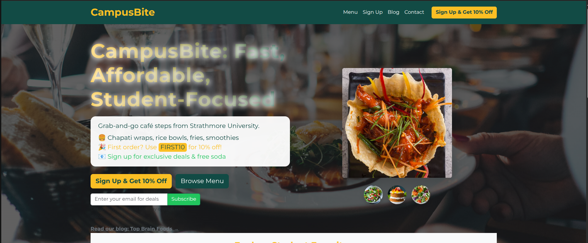
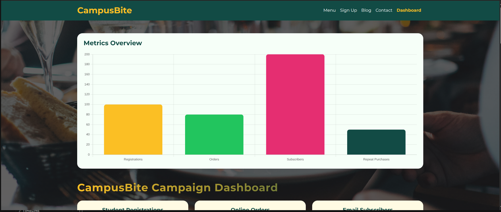

<p align="center">
  
</p>

# CampusBite – eMarketing Campaign Dashboard

CampusBite is a modern web application designed to power digital food ordering and marketing for university students. This project features a fully branded, actionable dashboard for tracking campaign performance, user engagement, and growth metrics, all tailored to a real-world eMarketing strategy.

---

## 🚀 Features

- **Branded Campaign Dashboard:** Visualize registrations, orders, email subscribers, engagement, and repeat purchases with a modern, mobile-friendly UI.
- **Advanced Analytics:** Interactive charts (Chart.js) for metrics overview, conversion funnel, email engagement, traffic trends, and customer segmentation.
- **eMarketing Best Practices:** Built-in conversion funnel, promo code ROI, social media metrics, email analytics, segmentation, reviews, and actionable recommendations.
- **PDF Export & Sharing:** Export the dashboard as a branded, color-accurate PDF for reporting or sharing with stakeholders.
- **Real-Time & Simulated Data:** See live campaign metrics, simulated traffic, and engagement for demo and planning.
- **Responsive & Accessible:** Built with Bootstrap, Montserrat font, and custom color palette for a professional, accessible experience.

---

## 🎯 eMarketing Strategy Context

CampusBite’s dashboard is designed to support a full-funnel digital marketing campaign:

- **Acquisition:** Track student registrations, online orders, and email signups from digital channels.
- **Engagement:** Monitor open/click rates, repeat purchases, and social media growth.
- **Conversion:** Visualize funnel drop-offs, promo code performance, and campaign ROI.
- **Retention:** Analyze repeat orders, email re-engagement, and customer reviews.
- **Segmentation:** Understand customer personas and tailor offers for maximum impact.
- **Actionable Insights:** Alerts and recommendations panel highlights opportunities and threats in real time.

---

## 🛠️ Tech Stack

- **Backend:** Laravel (PHP)
- **Frontend:** Blade, Bootstrap 5, Chart.js, Animate.css
- **PDF Export:** jsPDF, html2canvas
- **Database:** SQLite (dev), MySQL/Postgres (prod-ready)
- **Other:** Tailwind CSS, custom branding assets

---

## 📦 Getting Started

1. **Clone the repo:**
   ```bash
   git clone https://github.com/yourusername/campusbite.git
   cd campusbite
   ```
2. **Install dependencies:**
   ```bash
   composer install
   npm install && npm run build
   ```
3. **Set up environment:**
   - Copy `.env.example` to `.env` and set your DB credentials
   - Run migrations and seeders:
     ```bash
     php artisan migrate --seed
     ```
4. **Run the app:**
   ```bash
   php artisan serve
   ```
5. **Access the dashboard:**
   - Visit `http://localhost:8000/dashboard`

---


## 🏠 Home Page Preview



## 📊 Dashboard Preview



---

## 🤝 Contributing

Pull requests are welcome! For major changes, please open an issue first to discuss what you would like to change. Contributions should align with the project’s eMarketing and branding goals.

---

## 📄 License

This project is open-sourced under the [MIT license](https://opensource.org/licenses/MIT).
